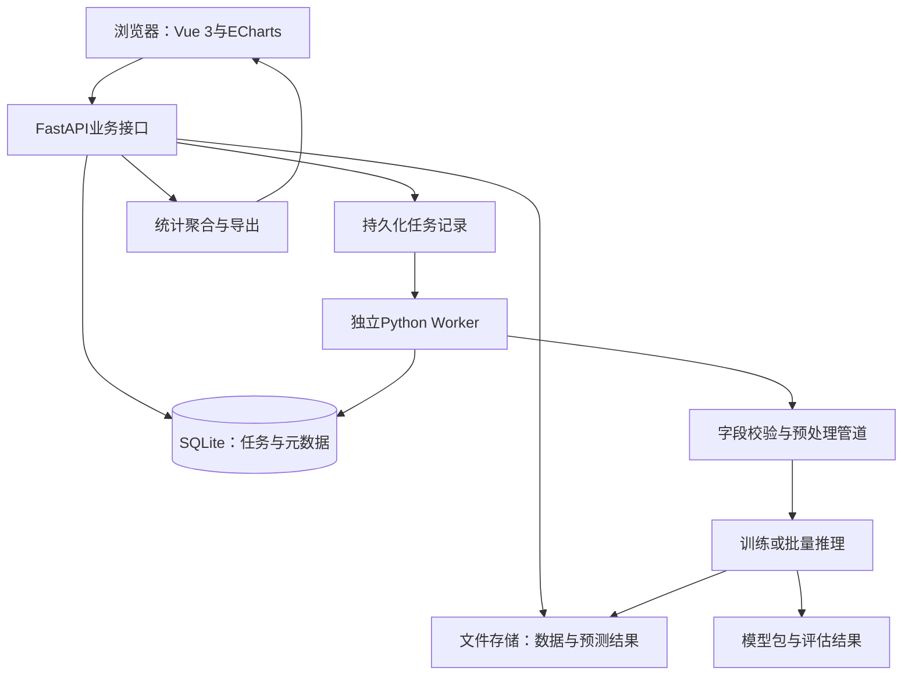

# 基于机器学习的网络入侵检测与可视化分析系统

本方案按本科毕业设计、单人开发、约8周工期设计。交付范围为系统设计、实现计划、实验方案、论文目录与答辩PPT逐页文案。本文没有把计划中的系统描述为已经实现，也不提供未经实验的性能数字。PPT部分为内容设计稿，尚非排版后的PPTX文件。

## 1. 选题与开题内容

推荐题目：**基于机器学习的网络入侵检测与可视化分析系统的设计与实现**。

研究定位：面向已提取的网络流量特征，完成攻击识别、检测结果追溯与可视化分析。算法实验和Web系统共用预处理管道及模型文件。

研究背景：网络流量包含连接持续时间、协议、包长和速率等统计信息，适合研究基于表格数据的机器学习分类。实际分析还需要呈现预测分布、误报漏报、类别差异以及检测记录，因此课题需要同时设计检测模型、评价方法和分析界面。

研究目标：
1. 建立可复现的流量特征清洗、训练、验证及测试流程。
2. 对比逻辑回归、决策树和随机森林的检测效果及推理成本。
3. 提供CSV导入、批量检测、结果检索、模型对比及报告导出。
4. 分析少数攻击类别表现和二分类阈值对误报、漏报的影响。

研究问题：
- 在统一数据划分与特征条件下，哪种模型更适合本系统？
- 类别权重及阈值调整是否改善少数类识别或误报控制？
- 如何把模型输出组织为可筛选、可解释、可追溯的分析结果？

基础范围：离线CSV流量特征、二分类、多模型对比、可视化、检测报告。
进阶范围：多分类、特征重要性、模型版本管理、阈值分析。
可选范围：SHAP单样本解释、批次回放、第二数据集独立复现。

实时抓包、自动阻断、未知攻击检测、跨网络泛化属于后续研究。批次回放须标为“离线回放”，不将其称为实时网络监测。使用完成流量的特征时，也不能宣称在连接结束前完成检测。

预期成果：可运行Web系统、训练与评估脚本、带元数据的模型包、实验结果文件、测试报告、论文、答辩PPT文案及演示流程。

## 2. 系统架构

采用B/S结构与模块化单体后端，重计算由独立Worker执行。



业务链路：上传文件、校验字段、选择模型、创建任务、Worker分块推理、保存结果、聚合展示、导出报告。

训练链路：读取固定划分、拟合预处理、训练候选模型、验证集选模与定阈值、锁定配置、最终测试、注册模型版本。

API提交任务后返回task_id，前端轮询状态。状态包含queued、running、succeeded、failed、cancelled。重启后将遗留running任务标记为interrupted，允许人工重试。基础版只启用一个Worker，简化任务抢占及SQLite写并发。

模型包包含预处理器、分类器、特征清单、标签映射、阈值、数据版本、依赖版本和训练参数。推理端复用完整模型包，不单独重写编码和标准化。

## 3. 功能模块及验收

|模块|主要功能|验收条件|
|---|---|---|
|数据管理|CSV上传、字段预览、类型与缺失值检查、文件摘要|错误列名或类型能定位并说明|
|实验管理|参数配置、训练任务、随机种子、划分版本、指标保存|相同配置可复现或解释随机差异|
|模型管理|模型版本、特征协议、标签映射、启用状态|模型与输入协议不匹配时拒绝运行|
|检测任务|批量预测、分块处理、进度、失败重试|任务完成后处理数量与结果数量一致|
|分析总览|预测攻击占比、类别分布、批次趋势|筛选条件在图表和列表中一致|
|检测明细|按任务、模型、预测类别和分数筛选，查看原始特征|每条预测能追溯到文件和原始行|
|模型评估|混淆矩阵、分类报告、PR曲线、模型比较|仅有真实标签且划分合规时显示性能指标|
|解释分析|全局重要性、误判样本、可选局部解释|明确重要性反映模型行为，不代表攻击因果|
|报告导出|结果CSV、含图表的HTML报告|导出内容与当前筛选及任务一致|
|账户与审计|可选管理员和分析员、关键操作日志|后端执行权限校验，密码以安全哈希保存|

用户流程示例：分析员上传兼容CSV，选择随机森林模型并启动检测，查看预测类别分布，点击某类别筛选明细，打开样本详情查看特征，导出对应结果。若导入带真实标签的数据，单独进入评估页面。

### 页面布局

1. 总览：样本总数、预测攻击数、预测攻击占比、任务处理耗时，下方放类别柱状图与批次趋势。
2. 数据管理：文件列表、校验结果、字段预览和上传入口。
3. 模型实验：算法选择、参数表单、任务日志和对比表。
4. 批量检测：数据和模型选择、任务进度、完成结果入口。
5. 检测明细：筛选栏、分页表格、样本详情抽屉。
6. 评估分析：混淆矩阵、每类Recall/F1、PR曲线和误判样本。

图表口径：没有原始时间戳时，横轴使用检测任务时间或批次编号。精选版CSV不具备的IP、经纬度等字段不作展示。没有真实标签时，不显示准确率、误报率或漏报率。预测分数不能直接等同于实际攻击概率或威胁严重度。

## 4. 技术栈

|层次|建议选型|用途|
|---|---|---|
|前端|Vue 3、TypeScript、Vite、Element Plus|管理页面和交互|
|图表|Apache ECharts|类别分布、趋势、混淆矩阵和指标比较|
|后端|Python、FastAPI、Pydantic|接口、字段校验和任务管理|
|机器学习|pandas、NumPy、scikit-learn|清洗、预处理、训练与评价|
|持久化|SQLAlchemy、SQLite|本地部署下的任务和元数据|
|大文件|CSV输入、Parquet结果|分块处理，避免大量行写入业务表|
|任务执行|单独Python Worker|避免训练长期占用接口请求|
|模型存储|joblib与JSON元数据|模型版本及推理协议|
|报告|Jinja2生成HTML|浏览器阅读及打印|
|测试|pytest及前端构建检查|核心协议、结果和接口验证|

版本在项目初始化时选择兼容组合并锁定，不以“始终最新”作为要求。CPU即可完成基础版，16GB内存作为开发规划参考，大文件需分块读取并限制树模型规模。实际耗时要记录机器配置后测量。

FastAPI官方文档建议将较重的后台计算考虑交给独立任务工具。本方案基础版采用独立Worker，后续多用户部署可替换为Redis与任务队列。[官方说明](https://fastapi.tiangolo.com/tutorial/background-tasks/)

仅加载系统自己训练和保存的可信joblib文件，网页不提供任意模型文件上传加载入口。

## 5. 数据集设计

### 主数据集：UNSW-NB15

采用官方提供的训练集和测试集。官方描述训练部分175,341条、测试部分82,332条，数据包含正常流量与9种攻击类型。下载后核验实际文件头、行数、类别计数和文件摘要，明确论文使用的是官方划分文件，而非整个原始数据集。[官方页面](https://research.unsw.edu.au/projects/unsw-nb15-dataset)

二分类目标使用label，多分类目标使用attack_cat。两种任务都从输入特征中移除label、attack_cat及id。将某个目标列留给另一任务作特征会泄露答案。

对常用官方划分CSV，应根据实际字段清单形成schema，不直接照抄整个数据集介绍的特征数量。数值特征可包括dur、sbytes、dbytes、spkts、dpkts等，类别特征包含proto、service、state。特殊字符串先确认含义，再决定保留类别或作缺失值处理。

### 备选数据集：CICIDS2017

适合扩展对比研究，官方提供PCAP及带标签的流量CSV，包含多种攻击场景。[官方页面](https://www.unb.ca/cic/datasets/ids-2017.html)

第二数据集应独立建立特征协议、预处理和实验，不将不同特征定义的数据直接拼接。若需要检验跨数据集迁移，必须先统一特征语义和标签空间，再设计专门实验。

### 划分与泄漏控制

1. 原始文件只读保存，记录来源、许可条款、摘要和行数。
2. 先检查重复特征记录、标签冲突及跨文件重叠，生成质量报告。
3. 官方测试集保持隔离，训练集内部划分约80%训练、20%验证。存在重复组时优先按组划分，并检查各类别覆盖。
4. 用训练子集拟合缺失值填补、编码、标准化和特征筛选，验证与测试仅transform。
5. 若使用交叉验证，每个fold内部单独拟合全部预处理和重采样。
6. 用验证集选参数和阈值，锁定方案后进行最终测试，不根据测试结果反复调参。
7. 有跨集合重复时明确报告原协议结果与预先定义的去重敏感性分析，说明处理方式及样本数量，不能悄悄修改测试集。

scikit-learn推荐通过Pipeline降低预处理造成的数据泄漏风险。[官方指南](https://scikit-learn.org/stable/common_pitfalls.html)

## 6. 算法与实验方案

### 模型路线

|模型|角色|重点观察|
|---|---|---|
|DummyClassifier|最低基线|类别失衡下只预测多数类的表现|
|逻辑回归|线性基线|训练效率、攻击Recall及PR表现|
|决策树|非线性基线|可解释性及过拟合|
|随机森林|主候选模型|总体指标、少数类指标和推理耗时|

不预先宣布随机森林获胜。先按验证集Macro-F1和攻击Recall评估，再结合误报率、耗时和模型大小决定部署版本。

数值特征用训练集统计量填补。逻辑回归加入标准化，树模型可省略标准化。类别字段使用OneHotEncoder并设置handle_unknown='ignore'。所有模型使用相同数据划分和语义一致的输入字段。

多分类单独训练一个覆盖Normal及各攻击类的分类器。它与二分类模型是两项独立任务，界面要求明确选择检测模式，避免将两个模型的输出混成同一次结论。

### 可控实验矩阵

E1：Dummy、逻辑回归、决策树、随机森林统一协议对比。
E2：随机森林默认类别权重与balanced类权重对比。
E3：二分类默认阈值与验证集选出的阈值对比。
E4（选做）：全特征与训练阶段选出的Top-k特征对比。

类别权重是基础方案。若追加SMOTE，只在训练折内使用，并处理类别特征，不能直接对全体数据或简单对独热编码作不加分析的插值。

随机森林的小规模搜索范围可设为n_estimators=[100,200]、max_depth=[None,20]、min_samples_leaf=[1,3]。先控制实验数量，记录种子。类别权重参数支持情况参见[RandomForestClassifier文档](https://scikit-learn.org/1.8/modules/generated/sklearn.ensemble.RandomForestClassifier.html)。

### 评价口径

以攻击作为二分类正类：
- Precision=TP/(TP+FP)，预测为攻击的样本中真实攻击所占比例。
- Recall=TP/(TP+FN)，真实攻击被发现的比例。
- F1=2×Precision×Recall/(Precision+Recall)。
- FPR=FP/(FP+TN)，正常样本被误报的比例。
- FNR=FN/(TP+FN)，攻击样本被漏报的比例。

二分类报告Precision、Recall、F1、FPR、PR-AUC，Accuracy作为补充。多分类报告Macro-F1、Weighted-F1、每类Recall/F1和support。明确PR-AUC采用哪一种计算定义，例如average_precision_score的AP，不混用不同面积算法。

性能测量包含固定批量的纯推理耗时、端到端任务耗时、吞吐量、模型大小。注明CPU、内存、线程数和批量大小。预热后重复测量并报告统计量，不能把文件解析和模型推理混为同一指标。

阈值策略可写为“在验证集FPR不超过预设上限的可行阈值中，选择Recall最高者”。上限是实验条件而非保证达到的指标。无可行阈值时如实报告；多分类采用argmax，低最大分数仅标为待复核，不能宣称发现未知攻击。

### 结果表模板

|模型|Macro-F1|攻击Recall|FPR|AP|纯推理耗时|模型大小|
|---|---|---|---|---|---|---|
|逻辑回归|待实验|待实验|待实验|待实验|待实验|待实验|
|决策树|待实验|待实验|待实验|待实验|待实验|待实验|
|随机森林|待实验|待实验|待实验|待实验|待实验|待实验|

任何摘要、论文结论和PPT结果页都只能引用实际产出的实验表。

## 7. 数据库与接口

|表|关键字段|
|---|---|
|datasets|id、name、path、sha256、schema_version、row_count、label_available、created_at|
|experiments|id、dataset_id、split_version、algorithm、params_json、seed、metrics_path、status|
|models|id、experiment_id、artifact_path、artifact_hash、feature_schema、label_map、threshold、dependency_versions|
|detection_tasks|id、dataset_id、model_id、status、processed_rows、total_rows、result_path、error、started_at、finished_at|
|audit_logs|id、actor、action、target_id、created_at|
|users（可选）|id、username、password_hash、role|

逐行预测保存到Parquet，包含task_id、source_row_id、predicted_label、score、可选true_label。样本详情通过文件与行号追溯原特征，业务数据库保留索引和聚合摘要。

API建议：
- POST /api/datasets：上传并校验文件。
- GET /api/datasets/{id}/preview：查看字段及样本。
- POST /api/experiments：创建训练任务。
- GET /api/experiments/{id}：查询状态和结果。
- GET /api/models：查询可用模型与协议。
- POST /api/detections：创建检测任务。
- GET /api/detections/{id}：查询进度及摘要。
- GET /api/detections/{id}/results：分页筛选明细。
- GET /api/detections/{id}/statistics：读取当前筛选条件下的统计。
- GET /api/detections/{id}/report：导出报告。

## 8. 实现步骤与工期

|周次|任务|阶段交付与验收|
|---|---|---|
|第1周|需求、数据下载、质量检查、schema和划分|数据字典、质量报告、冻结划分|
|第2周|预处理、Dummy及逻辑回归基线|训练脚本和真实基线指标|
|第3周|决策树、随机森林、类别权重和阈值实验|可追溯模型包、验证记录和最终测试表|
|第4周|数据接口、任务表、Worker、模型加载|API可完成一次端到端批量检测|
|第5周|前端数据管理、任务列表、检测明细|上传后可看到完整检测结果|
|第6周|图表联动、评估页、报告导出|图表与明细统计一致，报告可复查|
|第7周|异常处理、性能测量、系统测试|测试报告、问题修复、演示版本|
|第8周|论文整理、PPT、演示录屏和排练|论文定稿、答辩素材和备份|

第3周即冻结第一版实验方法，第6周冻结功能范围。时间不足时按顺序舍弃局部解释、第二数据集、账户模块和批次回放，保留完整检测及评价链路。

### 代码目录

```text
intrusion-detection/
  backend/app/        # API、服务、数据库与schema
  frontend/src/       # 页面、组件、请求与图表
  ml/                 # prepare、train、evaluate、predict
  worker/             # 任务领取、运行与状态恢复
  configs/            # 训练参数、特征协议与标签映射
  data/raw/           # 本地原始文件，不提交大文件
  data/processed/
  artifacts/          # 模型包和实验输出
  tests/              # 协议、评估、接口和任务流程
  docs/               # 设计、数据字典、实验与论文
```

### 有意义的系统测试

1. 缺失必需列、重复列名、非法类型和空文件能被准确拒绝。
2. 列顺序打乱后按schema重排，预测保持一致。
3. 推理遇到新协议类别时按约定处理，不导致进程崩溃。
4. label和attack_cat不会进入任何任务的特征矩阵。
5. 模型重新加载后同一输入的预测保持一致。
6. Worker异常退出后任务可识别并重试，不生成重复的最终结果。
7. 页面筛选、统计聚合和导出使用同一条件。
8. 无标签文件只展示预测统计，评估入口明确不可用。

## 9. 论文／报告目录

摘要；Abstract。

第1章 绪论
1.1 研究背景与意义
1.2 国内外研究现状
1.3 研究内容与目标
1.4 本文组织结构

第2章 相关技术与理论基础
2.1 网络入侵检测与流量特征
2.2 逻辑回归、决策树与随机森林
2.3 数据预处理与类别不平衡
2.4 分类评价指标与阈值
2.5 Web开发与可视化技术

第3章 系统需求分析与总体设计
3.1 应用场景与系统边界
3.2 功能需求和非功能需求
3.3 系统架构与业务流程
3.4 数据库设计
3.5 接口与模型版本设计

第4章 入侵检测模型设计与实验
4.1 数据来源、字段与质量分析
4.2 数据划分与泄漏控制
4.3 预处理和模型训练
4.4 实验环境与对比协议
4.5 类别权重与阈值实验
4.6 测试结果与误判分析

第5章 系统实现与可视化分析
5.1 数据导入与校验
5.2 模型加载与检测任务
5.3 结果查询与统计聚合
5.4 可视化交互与解释分析
5.5 报告导出与异常处理

第6章 系统测试与评价
6.1 测试环境与方法
6.2 功能与接口测试
6.3 任务恢复与异常测试
6.4 推理及端到端性能测试
6.5 适用范围与局限

第7章 总结与展望
7.1 工作总结
7.2 不足与后续研究

参考文献；致谢；附录（接口、数据字典、实验配置、操作说明）。

第4章聚焦模型有效性，第6章聚焦软件运行质量。研究现状需要另行检索、阅读全文并核对真实参考文献，不能把本设计稿中的技术说明当成完整文献综述。

### 可用摘要草稿

针对网络流量攻击识别和检测结果分析的需求，本文设计并实现一套基于机器学习的网络入侵检测与可视化分析系统。系统以UNSW-NB15流量特征数据为研究对象，构建包含数据校验、预处理、模型训练、批量检测及结果展示的处理流程。在统一的数据划分和评价协议下，对逻辑回归、决策树与随机森林进行比较，并分析类别权重和检测阈值对识别效果的影响。系统采用前后端分离架构，提供数据导入、任务管理、分类结果查询、模型评价及报告导出等功能。实验结果表明，[填写经过验证的主要结果与适用条件]。本研究为离线流量特征的入侵检测与分析提供了一种可复现的实现方案。

上段中的“实现”和“实验结果”只能在相应工作完成后用于最终论文，开题报告应改成“拟设计并实现”和“拟通过实验评价”。

## 10. 答辩PPT逐页设计

建议正文15页，讲解约10分钟，另安排2分钟演示，按学校规定调整。使用16:9白底、深蓝标题、青色强调，橙红仅用于攻击或错误信息。页面标题约32pt、正文至少约18pt。每页围绕一个问题，避免大段论文文字。

|页|标题|页面文案与内容|视觉材料|讲述要点|
|---|---|---|---|---|
|1|基于机器学习的网络入侵检测与可视化分析系统|姓名、学号、学院、指导教师、日期|简洁封面|说明课题研究离线流量特征识别及分析|
|2|研究背景与问题|流量分类需要模型；分析人员需要可追溯的检测结果；类别失衡影响评价|问题与需求对应表|说明为什么同时研究算法与系统|
|3|研究目标与范围|完成二分类和多模型对比；实现导入、检测及分析；扩展多分类|目标清单|明确CSV输入及离线检测边界|
|4|系统总体架构|浏览器、业务接口、Worker、模型包和存储|架构图|解释训练与推理共用模型包|
|5|数据集与质量分析|官方划分、实际样本计数、类别分布、字段类型|真实类别计数柱状图|交代来源和少数类别问题|
|6|预处理与实验划分|标签隔离、训练集拟合预处理、验证选模、测试评价|数据处理与隔离示意图|强调测试集不参与调参|
|7|模型设计|Dummy、逻辑回归、决策树和随机森林|模型对比表|说明基线与主候选模型的选择理由|
|8|实验方案与指标|统一划分；模型对比、类别权重与阈值实验；F1、Recall、FPR和耗时|实验矩阵|解释为什么Accuracy不足以单独评价|
|9|模型对比结果|填写实际测试指标及硬件条件，给出选型依据|真实结果表或柱状图|只讲可由结果支持的结论|
|10|误判与阈值分析|少数类表现、混淆类别、验证阈值及测试表现|混淆矩阵和阈值曲线|用实际样本解释误报与漏报|
|11|系统主要功能|数据导入、模型选择、检测任务和结果查询|真实系统截图|沿一次用户操作说明流程|
|12|可视化分析|类别分布联动明细、任务趋势、样本详情|真实分析页面截图|说明图表如何支持定位样本|
|13|系统测试|字段校验、模型一致性、异常恢复、实测耗时|测试汇总表|交代稳定性及适用规模|
|14|工作贡献与局限|统一模型管道、可追溯检测、阈值分析；离线数据和分布变化限制|贡献与局限两段文字|区别工程贡献与算法创新|
|15|总结与后续研究|归纳已经完成的目标；后续研究特征提取一致性、漂移与未知攻击|简洁总结页|结束后进入演示与提问|

第9、10、11、12、13页的结果图、截图和测试数字必须在实现后补充。开题汇报可分别替换为结果表模板、分析方法、页面线框图和测试计划，并明确标为设计内容。来源放在对应页面备注中。

### 两分钟演示脚本

0:00—0:20：打开数据管理，展示CSV字段检查及样本数。
0:20—0:40：选择已训练模型，提交小批量检测任务。
0:40—1:00：展示任务完成状态及预测结果统计。
1:00—1:25：点击攻击类别，联动筛选明细，查看一条样本的输入特征。
1:25—1:45：进入有标签的独立评估任务，展示混淆矩阵及每类指标。
1:45—2:00：导出报告并展示模型版本、输入文件摘要和评价口径。

答辩前准备经过本机测时的小文件、已完成任务和录屏备份。现场展示推理，训练过程展示已有日志及配置。
## 12. 完成检查表

- 开题文档中的目标与系统实际范围一致。
- 原始数据来源、摘要、许可及划分可追溯。
- 标签列不进入特征，预处理只在训练数据拟合。
- 基线、主模型和改进实验使用同一评价协议。
- 所有性能数字来自实际运行，能够从脚本重建。
- 上传、检测、筛选、图表和导出形成完整流程。
- 模型包包含字段协议、标签映射和依赖信息。
- 演示过程无需临时下载数据或现场长时间训练。
- 论文结论、PPT结果与实验文件一致。
- ```mermaid
flowchart TD
    A[用户浏览器] --> B[Vue 3 可视化界面]
    B --> C[FastAPI 业务接口]
    C --> D[(任务与模型元数据)]
    C --> E[数据文件与结果存储]
    C --> F[检测或训练任务]
    F --> G[独立 Python Worker]
    G --> H[字段校验与预处理]
    H --> I[模型训练或批量推理]
    I --> J[模型包与预测结果]
    J --> E
    G --> D
    C --> K[统计聚合与报告导出]
    K --> B
```
