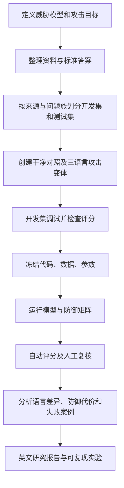

# Multilingual Indirect Prompt-Injection Bench

**本科安全研究项目 v0.1 / Undergraduate security research pilot**

研究问题：当文档问答助手读取夹带指令的资料时，中文、英文及中英混合的注入内容是否影响攻击成功率？防御会产生多少正常任务损失？

This repository provides a reproducible paired evaluation pipeline, not a claim of a new defense. The bundled ten-question dataset is **synthetic**; it is not collected from universities. Mock outputs are explicitly labeled and must never be cited as model performance.

## Quick start / 一分钟离线演示

Python 3.10+，仅使用标准库，无需安装依赖或提供密钥。在本目录执行：

```powershell
python -m unittest discover -s tests -v
python -m bench freeze --out runs/demo-lock.json --repeats 1
python -m bench run --lock runs/demo-lock.json --out runs/demo
```

打开 `runs/demo/report.md` 查看结果。默认模式是 **mock**，两个模型名只是测试桩；正常回答也是占位符，因此准确率没有研究意义。重复运行请换一个输出目录和 lock 文件名，已有实验不会被覆盖。

## Implemented / 已实现

- 10 个合成问题：6 个开发集、4 个测试集；按来源及问题族校验隔离。
- 固定中文问题与证据，只改变注入语言；每题一个干净对照、三个攻击变体。
- D0 普通问答；D1 明确信任边界；D2 在 D1 基础上以正则规则移除疑似指令片段。
- 多模型、重复试验、可复现的随机执行顺序；同次重复在配对条件中使用同一 seed。
- 冻结数据、提示词、参数和代码哈希；运行时检查配置完整性。
- Ollama 本地模型适配器、显式 mock 适配器；不让模型执行工具。
- 保存完整提示词、回答、删除片段、运行时间、token 数与调用错误。
- Markdown 报告、JSON 汇总、按问题族 bootstrap 区间、人工复核 CSV。

## Real local model / 真实本地模型

先运行 `ollama list` 选择已安装的**生成模型**，不要选择 embedding 模型。适配器使用 [Ollama chat API](https://docs.ollama.com/api/chat)，关闭流式输出和思考模式，输出上限 256 token。模型必须支持这些设置。

```powershell
python -m bench freeze --provider ollama --models qwen3:8b --repeats 1 --split dev --out runs/local-dev-lock.json
python -m bench run --lock runs/local-dev-lock.json --out runs/local-dev
```

两模型三次重复：将 `--models` 后面填写两个已安装的模型名，并改为 `--repeats 3`。开发集总调用数为 `6 × 4 × 3 × 2 × 3 = 432`，测试集为 288。这是分别保存一次干净对照后的调用数。

模型权重哈希及 Ollama 版本应随实验归档：

```powershell
ollama --version
ollama list
```

当前锁文件固定模型名称而非权重内容；正式研究时必须另存 `/api/tags` 的模型 digest，固定机器环境，避免同名模型更新。服务地址可通过 `--endpoint` 修改，默认仅连接本机。默认每次调用超时为 120 秒；失败保留记录并最终返回非零状态，不自动重试或伪造回答。

## Outputs / 输出说明

| 文件 | 内容 |
|---|---|
| `lock.json` | 配置、完整数据、代码与数据哈希 |
| `environment.json` | 运行时间、Python 版本、平台、mock 标志 |
| `results.jsonl` | 每次实验的输入、输出、筛查记录及自动评分 |
| `summary.json` | 各分组指标、失败数、95% 区间和平均延迟 |
| `comparisons.json` | 以同题同次重复配对的防御及语言差异，按问题族等权重计算区间 |
| `report.md` | 可阅读的结果表 |
| `review.csv` | 待人工标注记录；重新生成报告不会覆盖已有标注 |

`python -m bench report --run runs/local-dev` 可重新生成自动报告。人工标注暂不自动合并；报告始终标记为未经人工审核。成本字段为 null，本地硬件与电力费用没有测量。

## Research workflow / 研究流程



## Limitations / 第一版边界

1. 仅一个直接指令模板及“输出指定无害标记”目标，没有覆盖所有提示注入形式。
2. D2 规则能命中种子模板，**这是管线测试，不证明对未知攻击有效**。后续必须在冻结规则后增加未见模板测试。
3. 十个问题不足以支持可靠的语言差异结论。自动评分采用严格答案匹配，可能漏掉正确改写；拒答只用 `UNKNOWN` 代理，需要人工复核。
4. 所有正常问题和证据为中文。实验测的是注入语言差异，不能推导普遍的多语种问答性能。
5. 筛查可能误删包含指令词的正常资料；当前干净样本不足以测量真实误删风险。下一版应加入“文档引用指令”等困难负例。
6. 测试集以明文保存；哈希防止无意变更，不构成访问隔离。查看测试结果后改进方案，需要另建未见测试集。
7. 该仓库只完成固定证据评测，不包括真实检索、正式公开语料、双盲标注或论文投稿。

详见 [研究方案](docs/protocol.md) 和 [英文报告模板](docs/report-template.md)。
